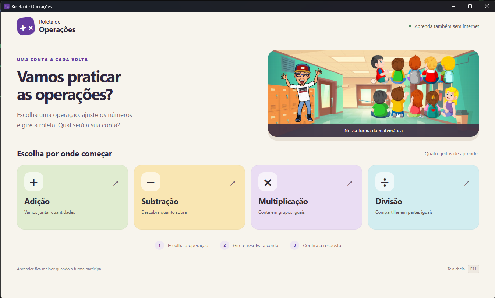
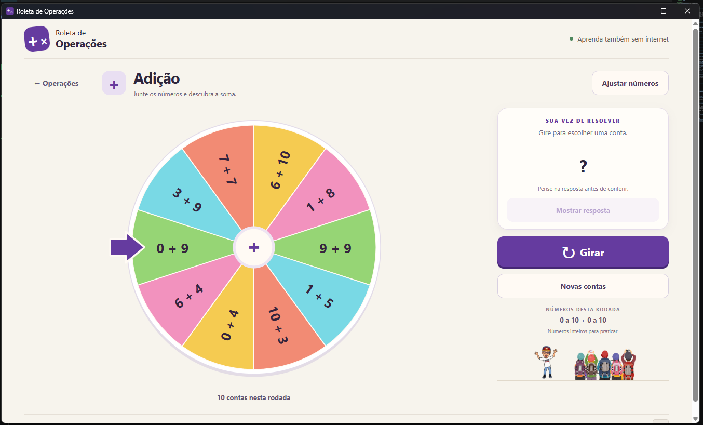
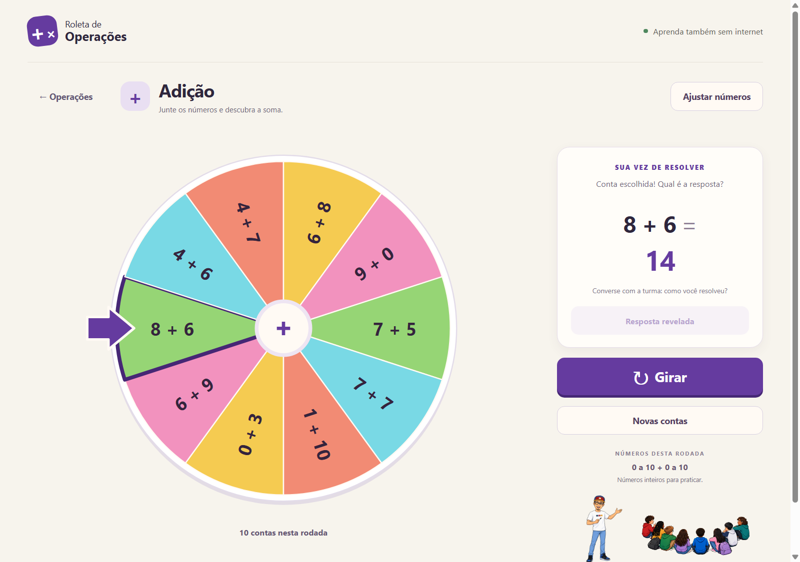
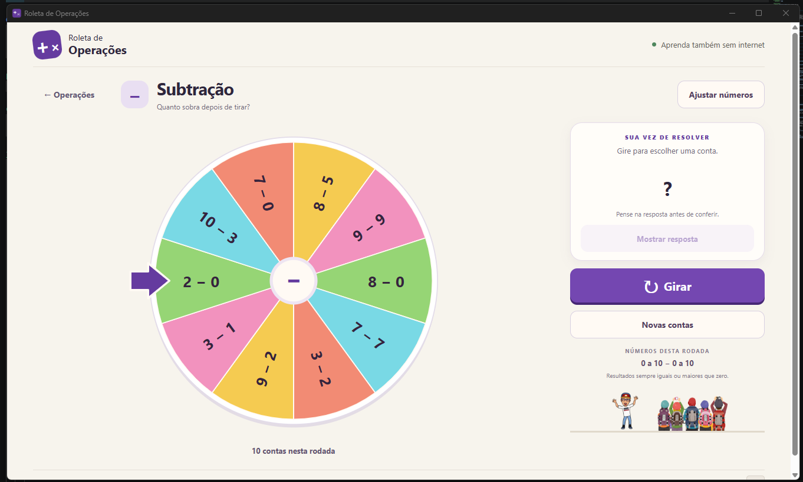
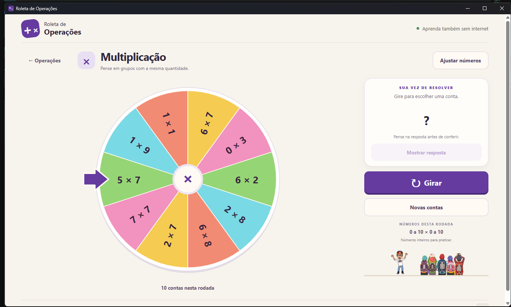
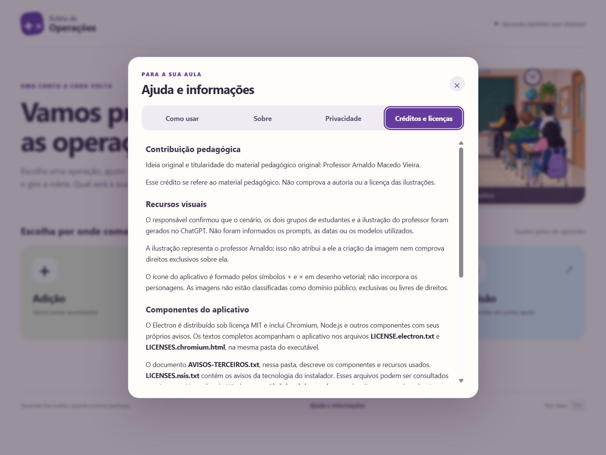

# Roleta de Operações

Aplicativo para praticar adição, subtração, multiplicação e divisão em sala de aula. Escolha uma operação, gire a roleta e use **Mostrar resposta** para conferir a conta selecionada.

Funciona offline desde a primeira abertura, em Windows 10 e 11 x64. O instalador inclui tudo o que o aplicativo precisa para funcionar.

## Baixar e instalar

**[Baixar para Windows — Release mais recente](https://github.com/grbvieira/Roleta-de-Operacoes/releases/latest)**

1. Abra a página acima e baixe o arquivo terminado em `Windows-x64-Instalador.exe`, na seção **Assets** da Release.
2. Execute o arquivo e siga as instruções de instalação.
3. Abra **Roleta de Operações** pelo atalho criado na área de trabalho ou no menu Iniciar.

Você pode baixar o arquivo em outro computador e levá-lo à escola por pendrive. A instalação e a atividade funcionam sem internet; não é necessário instalar Node.js ou PowerPoint.

As notas da versão e o SHA-256 do instalador estão na página da Release. Para consultar outras versões, acesse [Releases](https://github.com/grbvieira/Roleta-de-Operacoes/releases). Dúvidas e sugestões: `gersonrbvieira@gmail.com`.

## Telas do aplicativo

Capturas reais do aplicativo, com os recursos visuais da versão 1.1.0. As [capturas da v1.0.0](docs/referencias/capturas-v1.0.0/) foram preservadas como referência.

| Menu inicial | Adição |
| --- | --- |
|  |  |

| Resposta revelada | Subtração |
| --- | --- |
|  |  |

| Multiplicação | Divisão |
| --- | --- |
|  |  |

## Como usar

1. Escolha uma das quatro operações.
2. Em **Ajustar números**, defina os intervalos. Para fixar um número, use o mesmo valor no mínimo e no máximo.
3. Clique em **Girar** e aguarde a parada.
4. Resolva a conta indicada pela seta e clique em **Mostrar resposta**.
5. Use **Novas contas** para renovar a rodada.

A roleta tem até dez contas diferentes. As subtrações têm resultado não negativo e as divisões são exatas, sem divisor zero. As configurações ficam salvas por operação.

**F11** alterna a tela cheia. **Escape** fecha primeiro a ajuda ou os ajustes; sem diálogo aberto, sai da tela cheia. O [LEIA-ME.txt](LEIA-ME.txt) acompanha o aplicativo com as instruções para a escola.

## Ajuda e informações

O botão **Ajuda e informações**, no rodapé do menu e da atividade, abre quatro seções:

- **Como usar:** guia para conduzir a atividade, ajustar os números e usar os atalhos.
- **Sobre:** versão obtida do próprio aplicativo, autoria, crédito pedagógico e contato com o botão **Copiar e-mail**.
- **Privacidade:** o que fica salvo no computador e como funciona o contato opcional.
- **Créditos e licenças:** contribuição pedagógica, procedência dos recursos, avisos de terceiros e licença de uso completa.



A ajuda funciona offline. Use **Tab** para percorrer os controles e as setas, **Home** ou **End** para trocar de seção. Ao fechar, o foco volta ao botão de ajuda. Abrir a janela preserva a rodada, a seleção e a resposta; durante o giro, o botão fica temporariamente desabilitado.

Os intervalos são armazenados por operação no perfil local do usuário. O aplicativo não tem cadastro, campos para dados de alunos, histórico salvo de respostas ou telemetria. Para entrar em contato, copie `gersonrbvieira@gmail.com` e use seu aplicativo de e-mail; o envio depende desse aplicativo e de internet.

O aplicativo usa cenário, grupos de estudantes e representação do professor, com elementos separados e proporções preservadas. O responsável confirmou que os quatro novos recursos foram gerados no ChatGPT; veja [ORIGEM.md](app/assets/ORIGEM.md). Os componentes distribuídos estão no [inventário de terceiros](docs/terceiros.md).

As mudanças desde a versão anterior estão nas [notas da v1.1.0](docs/notas/v1.1.0.md). Consulte a página de Releases para baixar a distribuição disponível.

## Licença de uso

Software de Gerson Vieira sob [licença proprietária de uso gratuito](LICENSE.txt) para pessoas, professores e instituições públicas ou privadas, inclusive em aulas remuneradas. A versão recebida permanece gratuita enquanto a licença for cumprida, sem cobrança retroativa ou expiração automática. Versões futuras, edições adicionais e serviços poderão ser pagos.

É permitido compartilhar o link oficial de download. Modificação, revenda, sublicenciamento e redistribuição dependem de autorização, com as ressalvas da licença, da lei, dos termos do GitHub e das licenças de terceiros. As permissões de visualização e fork do repositório público são preservadas. O texto completo também está disponível offline em **Créditos e licenças** e junto ao executável. Autorizações: `gersonrbvieira@gmail.com`.

O crédito pedagógico ao Professor Arnaldo Macedo Vieira não estende essa licença ao PowerPoint original. O licenciamento do software não promete direitos exclusivos sobre os recursos gerados com IA.

## Compatibilidade

A distribuição é para **Windows 10 e 11 x64 (Intel/AMD)**. Windows 7, 8, 8.1 e sistemas de 32 bits não são suportados. Não há pacote nativo ARM64 neste projeto. A compatibilidade acompanha o [Electron 44.3.0](https://github.com/electron/electron/blob/v44.3.0/README.md#platform-support).

O instalador não tem assinatura digital. O usuário confirmou o funcionamento no computador da escola e a desinstalação; não relatou teste de atualização entre versões. A abrangência desses relatos e das verificações automatizadas está no [registro de testes](docs/validacao.md).

## Desenvolvimento

Requisitos: Git, Node.js 22.12 ou posterior e npm. No PowerShell:

```powershell
git clone https://github.com/grbvieira/Roleta-de-Operacoes.git
cd Roleta-de-Operacoes
npm.cmd ci
npm.cmd start
```

O primeiro download das dependências precisa de internet. `npm.cmd start` abre a janela Electron. Node.js e npm são ferramentas de desenvolvimento; não precisam ser instalados no computador da escola.

## Testes

```powershell
npm.cmd test
npm.cmd run test:desktop
```

O primeiro comando testa as regras matemáticas e a seleção da roleta. O segundo verifica os fluxos na janela Electron, incluindo giro, resposta, renovação e persistência, com rede emulada offline.

Os relatórios e as capturas ficam em `test-results/`. A cobertura e as limitações estão em [docs/validacao.md](docs/validacao.md).

## Gerar a distribuição

No Windows, com as dependências instaladas:

```powershell
npm.cmd run dist:win
npm.cmd run test:packaged
npm.cmd run verify:distribution
```

Arquivos gerados para a versão 1.1.0:

```text
dist/Roleta-Operacoes-1.1.0-Windows-x64-Instalador.exe
dist/Roleta-Operacoes-1.1.0-Windows-x64.zip
dist/SHA256SUMS.txt
```

O empacotamento pode baixar ferramentas ainda ausentes do cache. Depois de gerado, o pacote funciona sem internet. Para gerar apenas a pasta do aplicativo, use `npm.cmd run pack:win`.

O ZIP gerado localmente também permite executar a atividade: extraia a pasta inteira e abra `Roleta de Operações.exe`, mantendo os arquivos auxiliares juntos. A Release v1.0.0 disponibiliza somente o instalador.

`test:packaged` testa o executável em `dist/win-unpacked/`. `verify:distribution` confere o código e as imagens empacotados e grava os hashes do instalador e do ZIP.

Os pacotes ficam fora do Git. O comando local de empacotamento não publica nada; o GitHub Actions publica o instalador em [Releases](https://github.com/grbvieira/Roleta-de-Operacoes/releases) quando uma tag de versão é enviada e todas as verificações passam. O ZIP do botão **Code** contém o código-fonte, não o aplicativo pronto.

## Publicar uma versão

O workflow [Release Windows](.github/workflows/release-windows.yml) é acionado por tags como `v1.0.0`. Ele confere a versão do aplicativo e do lock, executa os testes e gera o instalador em um runner Windows. A Release recebe o instalador, notas automáticas e o SHA-256 do arquivo.

Veja o [procedimento de lançamento](docs/releases.md) para atualizar a versão, enviar a tag e tratar uma execução que falhou. Releases existentes nunca são substituídas automaticamente.

## Código e documentação

- [Arquitetura](docs/arquitetura.md): módulos, regras das contas e cálculo do giro.
- [Testes](docs/validacao.md): verificações realizadas, relatos do usuário e limites da cobertura.
- [Lançamentos](docs/releases.md): publicação do instalador pelo GitHub Actions.
- [Versão 1.1.0](docs/notas/v1.1.0.md): notas das alterações.
- [Origem das imagens](app/assets/ORIGEM.md): recursos atuais e procedência informada.
- [Componentes e avisos](docs/terceiros.md): runtime, ferramentas e licenças de terceiros.

O PowerPoint `roleta da adição.pptx` é uma referência local e está no `.gitignore`. As imagens necessárias já estão em `app/assets/`; o original não é necessário para executar ou empacotar o projeto. Quem tiver o arquivo na raiz pode conferir sua integridade com `npm.cmd run verify:reference`.
